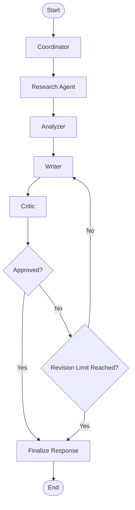

# Agent Communication Flow Diagram

This diagram illustrates the workflow and communication between the five agents in the ShopEase Customer Support System.

```mermaid
flowchart TD
    S([Start]) --> C[Coordinator]
    C --> R[Research Agent]
    R --> A[Analyzer]
    A --> W[Writer]
    W --> K[Critic]
    K --> D{Approved?}

    D -- Yes --> F[Finalize Response]
    D -- No --> L{Revision Limit Reached?}

    L -- No --> W
    L -- Yes --> F

    F --> E([End])
```
