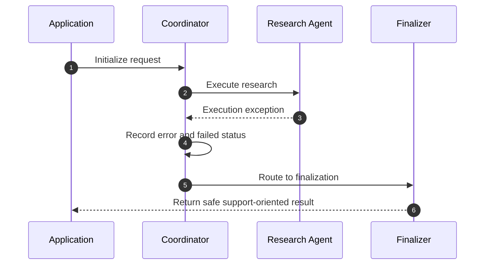

### Error Handling Sequence

```mermaid
sequenceDiagram
    autonumber
    participant App as Application
    participant C as Coordinator
    participant R as Research Agent
    participant F as Finalizer

    App->>C: Initialize request
    C->>R: Execute research
    R-->>C: Execution exception
    C->>C: Record error and failed status
    C->>F: Route to finalization
    F-->>App: Return safe support-oriented result
```
